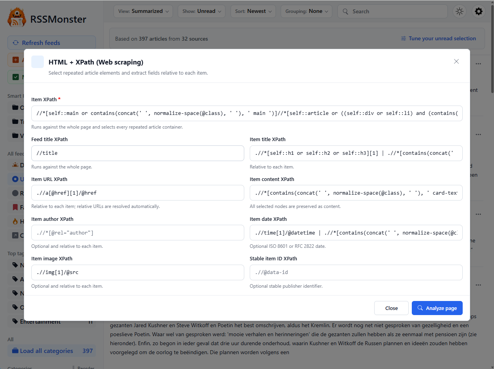

# HTML + XPath Feeds

HTML + XPath feeds let RSSMonster follow websites that do not provide a usable
RSS or Atom feed. RSSMonster downloads the webpage, uses XPath expressions to
identify repeated article elements, and converts the extracted results into
normal feed articles.

## Create an HTML + XPath Feed

1. Open **Add new feed**.
2. Enter the website URL, choose a category and crawl period, and select
   **Validate feed**.
3. If the URL returns a valid RSS or Atom feed, RSSMonster continues with the
   normal feed workflow.
4. If the website responds successfully but the page is not an RSS or Atom
   feed, RSSMonster opens the **HTML + XPath (Web scraping)** dialog and
   analyzes the page.

A timeout, unreachable host, or empty response produces a validation error
instead, because RSSMonster has no page content it can safely preview.

## Configure the XPath Expressions

RSSMonster starts with general-purpose expressions that work for many common
article and card layouts. Change them when the initial analysis does not select
the right content.

The fields have two different scopes:

- **Item XPath** runs against the complete document. It must select every
  repeated element that represents an article or entry.
- **Feed title XPath** also runs against the complete document.
- All other item fields run relative to each element selected by **Item
  XPath**. Relative expressions normally begin with `.`.

At least one of **Item title XPath**, **Item URL XPath**, or **Item content
XPath** must be configured.

| Field | Purpose |
| --- | --- |
| Item XPath | Selects the repeated article containers. |
| Feed title XPath | Extracts the name of the webpage feed. |
| Item title XPath | Extracts each article title. |
| Item URL XPath | Extracts each article link. Relative links are resolved against the webpage URL. |
| Item content XPath | Selects the text or HTML stored as the article content. |
| Item author XPath | Extracts the optional author name. |
| Item date XPath | Extracts an optional ISO 8601 or RFC 2822 publication date. |
| Item image XPath | Extracts an optional image URL. |
| Stable item ID XPath | Extracts a publisher identifier that can help RSSMonster recognize the same item on later crawls. |

Select **Analyze page** after changing the expressions.

## Review the Extracted Articles

The preview shows what RSSMonster was able to extract before anything is
saved. It reports the number of matched elements and usable articles and shows
up to five example results.

Check that:

- each preview card represents a distinct article;
- titles and links point to the expected content;
- the extracted summary or body contains useful article text;
- dates, authors, images, and stable IDs are correct when configured.

Select **Adjust rules** to return to the XPath editor. Select **Accept** when
the preview is satisfactory. RSSMonster returns to **Add new feed** and fills
in the discovered feed name and description. Review those values and select
**Save changes** to create the feed.

Closing or returning from the preview does not store a feed by itself. The
feed is created only when it is saved from **Add new feed**.

## What Happens During Crawling

After the feed is saved, RSSMonster uses the same webpage URL and XPath rules
on every crawl. Extracted entries continue through the normal RSSMonster
article pipeline, including identity handling, filtering, content
normalization, duplicate detection, and optional AI processing.

RSSMonster skips extraction when the server reports that the page has not
changed. Fetch failures, timeouts, invalid stored expressions, and pages that
no longer contain matching items are recorded as feed crawl failures rather
than silently producing articles.

HTML + XPath extraction processes the HTML returned by the web server. It does
not run webpage JavaScript, so content rendered only in the browser may not be
available for extraction.

## Troubleshooting

### No items are found

Make **Item XPath** less specific and confirm it selects the repeated container
around each article, not a single title or link.

### Titles or URLs repeat

Make item-field expressions relative to the selected item. For example, use
`.//h2` or `.//a[1]/@href` rather than a document-level expression such as
`//h2`.

### Too much content is stored

Narrow **Item content XPath** to the summary or article-body element instead
of selecting the complete item container.

### The preview works but a later crawl fails

The publisher may have changed the page structure. Analyze the page again with
expressions that match its current HTML before creating a replacement feed.
